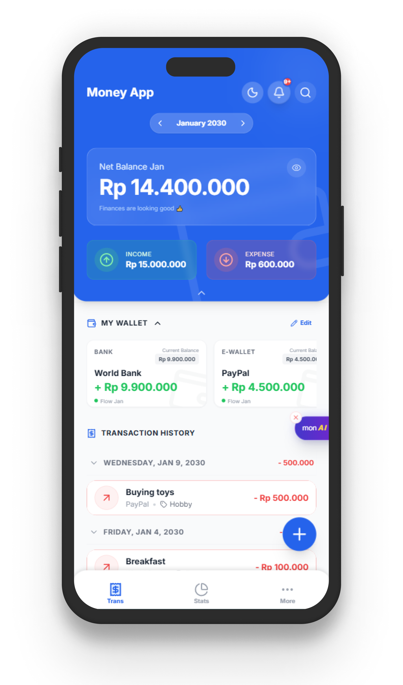
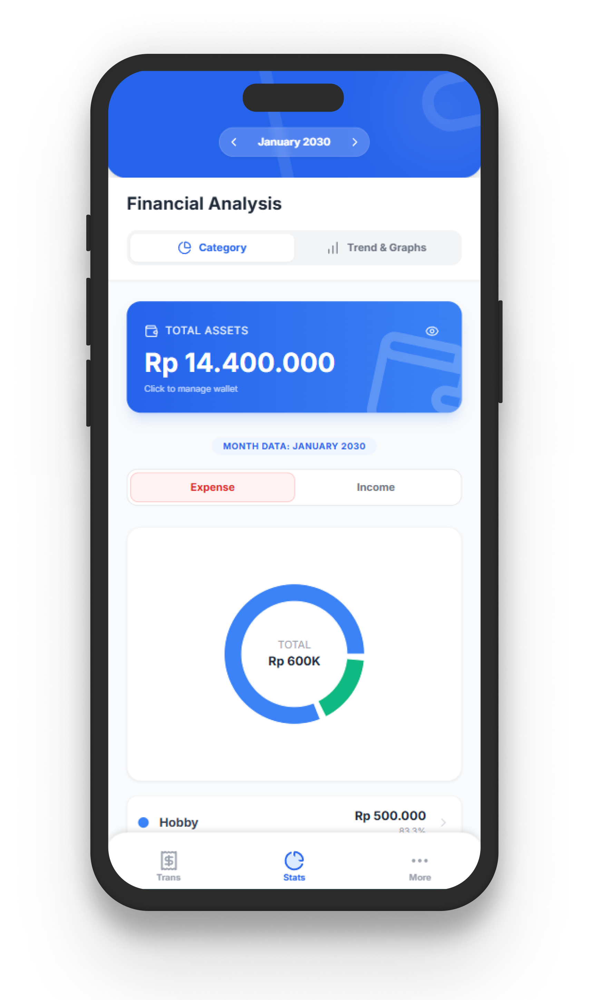
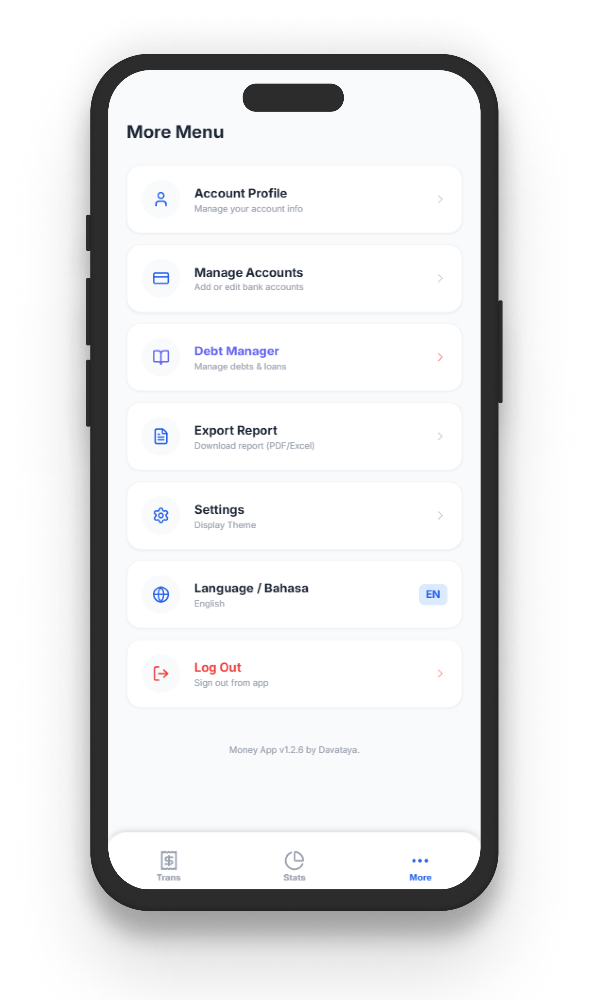
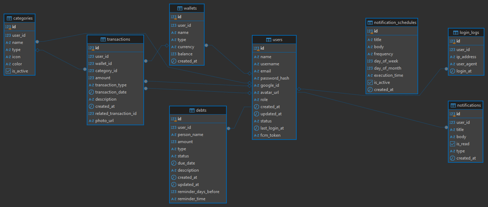

# 💰 Money App - Full-Stack Personal Finance PWA

A comprehensive, Progressive Web App (PWA) designed for seamless personal finance management. Built with a robust Double-Entry Bookkeeping architecture, this application ensures your financial data is always synchronized, accurate, and easily accessible across all devices mobile (Android, iOS) Dekstop is not recomended.

This repository is structured as a **Monorepo**, housing both the React/Vite Frontend and the Golang/Echo Backend.

## 📸 Application Preview

Here is a sneak peek of the user interface, featuring a clean, responsive, and intuitive design available in both light and dark themes.

<p align="center">
  
  &nbsp; &nbsp; &nbsp;
  
  &nbsp; &nbsp; &nbsp;
  
</p>

## ✨ Key Features

* 🔄 **Double-Entry Bookkeeping:** Synchronized transfer system between multiple wallets to maintain perfect balance integrity.
* 🤖 **AI Financial Assistant (Powered by Gemini):** Smart insights and financial advice with an intelligent 5-key auto-rotation system to prevent API rate limits.
* 📱 **PWA Ready:** Fully installable as a Progressive Web App on Android and iOS devices for a native-like experience.
* 🤝 **Debt Manager:** Track debts and loans with an integrated Firebase push-notification system to send automated self-reminders.
* 📊 **Dynamic Reporting:** Instantly export financial histories and reports into high-quality PDF and Excel formats.
* 🗑️ **Safe "Soft Delete":** Categories can be archived without permanently destroying historical transaction data.
* 🧹 **Auto-Cleanup Scheduler:** Automated background cron jobs to periodically clean up stale or temporary data.
* 🔔 **Real-Time Notifications:** Integrated with Firebase to deliver instant transaction alerts and reminders.
* 👥 **User Management System:** Dedicated admin roles to manage user access and monitor system logs.
* 🌍 **Bilingual Support:** Easily toggle between multiple languages for a localized experience.
* 🌗 **Adaptive Theme:** Built-in Light and Dark modes for optimal visual comfort.

---

## 🛠️ Technology Stack & Prerequisites

To run this application, ensure you have the following installed on your machine:

* **Backend:** Go (Version **1.25.5** or higher)
* **Frontend:** Node.js (Version **v22.18.0** or higher)
* **Database:** PostgreSQL (Version **14.20** or higher)

---

## 🗄️ Database Architecture

The application relies on a highly relational PostgreSQL database structure to ensure data consistency across transactions, users, debts, and wallets. 

*(ERD Structure)*



---

## 🚀 Getting Started (Local Development)

Because this application utilizes a decoupled architecture, you will need to run the Backend and Frontend in **TWO separate terminal windows**.

### Part 1: Backend Setup (Terminal 1)
1. Navigate to the backend directory:
   ```bash
   cd backend
2. Duplicate the environment example file and configure your PostgreSQL and Firebase credentials:
   cp .env.example .env
3. Download the necessary Go modules and start the server:
   go mod tidy
   go run cmd/api/main.go
The backend server will typically run on http://localhost:8080.

### Part 2: Frontend Setup (Terminal 2)
1. Navigate to the frontend directory:
   cd frontend
2. Duplicate the environment example file. Ensure VITE_API_URL points to your running Backend port:
   cp .env.example .env
3. Install dependencies and start the Vite development server:
   npm install
   npm run dev
4. Open your browser and navigate to the URL provided by Vite (usually http://localhost:5173).

---

## 🤝 Let's Connect

Created by **Dava Ataya**.
If you have any questions about this project, the architecture, or potential collaborations, feel free to reach out!

**LinkedIn**: [Insert your LinkedIn URL here]

**Email**: [Insert your Email here]

_This project is for portfolio and demonstration purposes. Please ensure you secure all environment variables and Firebase JSON keys before deploying to a public server._
